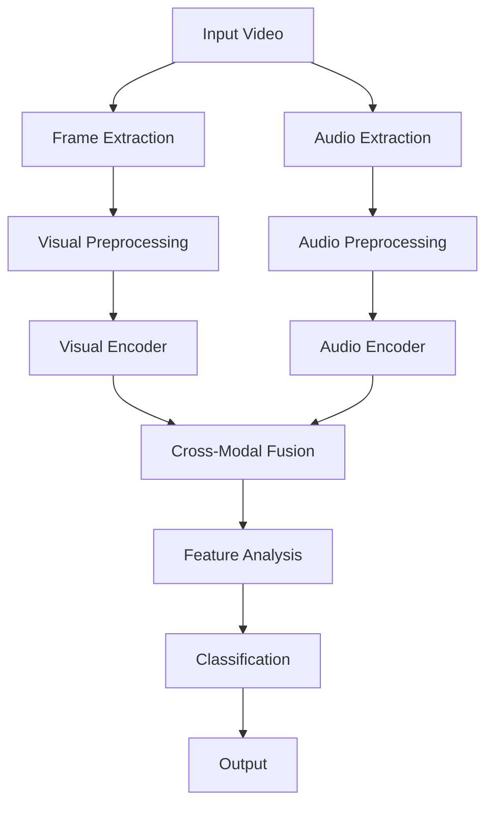

# AVFF (Audio-Visual Feature Fusion) Deepfake Detector: Comprehensive Course Material

## Table of Contents
1. [Fundamentals of Deepfake Detection](#fundamentals)
2. [System Architecture and Design](#architecture)
3. [Data Processing and Feature Extraction](#data-processing)
4. [Model Components and Implementation](#model-components)
5. [Training Process and Optimization](#training)
6. [Inference and Real-world Deployment](#inference)
7. [Evaluation and Performance Analysis](#evaluation)
8. [Advanced Topics and Research](#advanced-topics)
9. [Practical Implementation Guide](#implementation)
10. [Troubleshooting and Best Practices](#troubleshooting)

## 1. Fundamentals of Deepfake Detection

### 1.1 Understanding Deepfakes
1. **Definition and History**
   - Understanding the evolution of deepfake technology is crucial to anticipate future threats and develop appropriate countermeasures.
   - Evolution of deepfake technology
   - Common deepfake generation methods
   - Real-world implications and challenges

2. **Types of Deepfakes**
   - Different types of deepfakes require different detection strategies and feature analysis approaches.
   - Face swapping
   - Voice cloning
   - Expression manipulation
   - Lip-sync manipulation
   - Full body manipulation

3. **Detection Challenges**
   - Identifying these challenges helps in designing robust detection systems that can handle real-world scenarios.
   - Temporal consistency
   - Spatial artifacts
   - Audio-visual synchronization
   - Adversarial attacks
   - Real-time processing requirements

### 1.2 Audio-Visual Analysis
1. **Visual Analysis**
   - Visual analysis is essential because deepfakes often leave subtle visual artifacts that can be detected through careful analysis.
   - Facial landmarks and geometry
   - Texture analysis
   - Motion patterns
   - Lighting consistency
   - Blink patterns and eye movement

2. **Audio Analysis**
   - Audio analysis is crucial because voice manipulation often creates detectable inconsistencies in speech patterns and voice characteristics.
   - Voice characteristics
   - Speech patterns
   - Background noise analysis
   - Audio artifacts
   - Temporal consistency

3. **Cross-Modal Analysis**
   - Cross-modal analysis is vital because it helps detect inconsistencies between audio and visual modalities that are difficult to fake perfectly.
   - Lip-sync analysis
   - Emotion consistency
   - Temporal alignment
   - Feature correlation
   - Synchronization patterns

## 2. System Architecture and Design

### 2.1 High-Level Architecture
- A well-designed architecture is crucial for efficient processing and accurate detection of deepfakes.


### 2.2 Component Design
1. **Input Processing Module**
   - Proper input processing ensures high-quality feature extraction and maintains synchronization between audio and visual streams.
   ```python
   class InputProcessor:
       def __init__(self):
           self.video_processor = VideoProcessor()
           self.audio_processor = AudioProcessor()
           self.sync_manager = SynchronizationManager()
           
       def process_input(self, video_path):
           # Frame extraction with quality control
           frames = self.video_processor.extract_frames(video_path)
           
           # Audio extraction with preprocessing
           audio = self.audio_processor.extract_audio(video_path)
           
           # Synchronization management
           synchronized_data = self.sync_manager.sync(frames, audio)
           
           return synchronized_data
   ```

2. **Feature Extraction Pipeline**
   - A robust feature extraction pipeline is essential for capturing both subtle and obvious manipulation artifacts.
   - Visual feature extraction
   - Audio feature extraction
   - Temporal feature alignment
   - Quality control mechanisms

3. **Fusion Architecture**
   - Effective fusion architecture is necessary to combine audio and visual features in a way that enhances detection accuracy.
   - Early fusion strategies
   - Late fusion approaches
   - Hierarchical fusion
   - Attention mechanisms

### 2.3 System Requirements
1. **Hardware Requirements**
   - Understanding hardware requirements is crucial for optimal system performance and deployment planning.
   - GPU specifications
   - Memory requirements
   - Storage considerations
   - Processing power needs

2. **Software Dependencies**
   - Proper software dependencies ensure compatibility and access to necessary tools for deepfake detection.
   - Deep learning frameworks
   - Audio processing libraries
   - Video processing tools
   - Utility libraries

## 3. Data Processing and Feature Extraction

### 3.1 Video Processing
1. **Frame Extraction**
   - Efficient frame extraction is crucial for maintaining video quality while optimizing processing time.
   ```python
   class FrameExtractor:
       def __init__(self, target_size=(224, 224), frame_count=16):
           self.target_size = target_size
           self.frame_count = frame_count
           self.face_detector = FaceDetector()
           
       def extract_frames(self, video_path):
           # Open video file
           cap = cv2.VideoCapture(video_path)
           
           # Calculate frame sampling
           total_frames = int(cap.get(cv2.CAP_PROP_FRAME_COUNT))
           frame_indices = self._calculate_frame_indices(total_frames)
           
           frames = []
           for idx in frame_indices:
               cap.set(cv2.CAP_PROP_POS_FRAMES, idx)
               ret, frame = cap.read()
               
               if ret:
                   # Face detection and alignment
                   face = self.face_detector.detect_and_align(frame)
                   
                   # Preprocessing
                   processed_frame = self._preprocess_frame(face)
                   frames.append(processed_frame)
           
           return torch.stack(frames)
           
       def _calculate_frame_indices(self, total_frames):
           # Uniform sampling with quality checks
           return np.linspace(0, total_frames-1, self.frame_count, dtype=int)
           
       def _preprocess_frame(self, frame):
           # Resize
           frame = cv2.resize(frame, self.target_size)
           
           # Normalize
           frame = frame.astype(np.float32) / 255.0
           frame = (frame - [0.485, 0.456, 0.406]) / [0.229, 0.224, 0.225]
           
           return torch.from_numpy(frame).permute(2, 0, 1)
   ```

2. **Quality Control**
   - Quality control ensures that only high-quality frames are processed, improving detection accuracy.
   - Face detection and alignment
   - Blur detection
   - Motion analysis
   - Lighting consistency
   - Frame quality assessment

3. **Feature Enhancement**
   - Feature enhancement helps highlight manipulation artifacts that might be difficult to detect in raw frames.
   - Contrast enhancement
   - Noise reduction
   - Edge detection
   - Texture analysis
   - Motion compensation

### 3.2 Audio Processing
1. **Audio Extraction**
   - Proper audio extraction and processing is essential for capturing voice manipulation artifacts.
   ```python
   class AudioProcessor:
       def __init__(self, sample_rate=16000, n_mels=64):
           self.sample_rate = sample_rate
           self.n_mels = n_mels
           self.mel_transform = torchaudio.transforms.MelSpectrogram(
               sample_rate=sample_rate,
               n_fft=1024,
               hop_length=512,
               n_mels=n_mels
           )
           
       def process_audio(self, audio_path):
           # Load audio
           waveform, sr = torchaudio.load(audio_path)
           
           # Resample if necessary
           if sr != self.sample_rate:
               resampler = torchaudio.transforms.Resample(sr, self.sample_rate)
               waveform = resampler(waveform)
           
           # Convert to mono
           if waveform.shape[0] > 1:
               waveform = torch.mean(waveform, dim=0, keepdim=True)
           
           # Compute mel spectrogram
           mel_spec = self.mel_transform(waveform)
           
           # Log scale
           mel_spec = torch.log(mel_spec + 1e-6)
           
           return mel_spec
   ```

2. **Feature Extraction**
   - Effective audio feature extraction is crucial for detecting subtle voice manipulation patterns.
   - Mel spectrogram computation
   - MFCC extraction
   - Voice activity detection
   - Noise reduction
   - Temporal analysis

3. **Advanced Audio Processing**
   - Advanced audio processing helps isolate and analyze specific voice characteristics that are difficult to fake.
   - Voice separation
   - Background noise analysis
   - Spectral analysis
   - Temporal alignment
   - Feature normalization

## 4. Model Components and Implementation

### 4.1 Visual Encoder
1. **Architecture Design**
   - A well-designed visual encoder is crucial for extracting meaningful features from video frames.
   ```python
   class VisualEncoder(nn.Module):
       def __init__(self, backbone='resnet50', pretrained=True):
           super().__init__()
           
           # Backbone selection
           if backbone == 'resnet50':
               self.backbone = models.resnet50(pretrained=pretrained)
               self.feature_dim = 2048
           else:
               raise NotImplementedError(f"Backbone {backbone} not implemented")
           
           # Remove classification head
           self.backbone = nn.Sequential(*list(self.backbone.children())[:-1])
           
           # Feature projection
           self.projection = nn.Sequential(
               nn.Linear(self.feature_dim, 1024),
               nn.ReLU(),
               nn.Dropout(0.5),
               nn.Linear(1024, 512)
           )
           
           # Attention mechanism
           self.attention = nn.MultiheadAttention(512, num_heads=8)
           
       def forward(self, x):
           # Extract features
           features = self.backbone(x)
           features = features.squeeze(-1).squeeze(-1)
           
           # Project features
           features = self.projection(features)
           
           # Apply attention
           features = features.unsqueeze(0)
           attn_output, _ = self.attention(features, features, features)
           features = attn_output.squeeze(0)
           
           return features
   ```

2. **Feature Processing**
   - Advanced feature processing helps capture both local and global manipulation artifacts.
   - Spatial attention
   - Temporal aggregation
   - Multi-scale features
   - Feature normalization
   - Dimensionality reduction

### 4.2 Audio Encoder
1. **Architecture Design**
   - An effective audio encoder is essential for capturing voice manipulation patterns and artifacts.
   ```python
   class AudioEncoder(nn.Module):
       def __init__(self, input_size=1024, hidden_size=512):
           super().__init__()
           
           # Convolutional layers
           self.conv_layers = nn.Sequential(
               nn.Conv1d(1, 64, kernel_size=3, padding=1),
               nn.ReLU(),
               nn.MaxPool1d(2),
               nn.Conv1d(64, 128, kernel_size=3, padding=1),
               nn.ReLU(),
               nn.MaxPool1d(2),
               nn.Conv1d(128, 256, kernel_size=3, padding=1),
               nn.ReLU()
           )
           
           # Attention mechanism
           self.attention = nn.MultiheadAttention(256, num_heads=8)
           
           # Feature projection
           self.projection = nn.Sequential(
               nn.Linear(256, hidden_size),
               nn.ReLU(),
               nn.Dropout(0.5)
           )
           
       def forward(self, x):
           # Convolutional processing
           features = self.conv_layers(x)
           
           # Apply attention
           features = features.permute(2, 0, 1)
           attn_output, _ = self.attention(features, features, features)
           features = attn_output.permute(1, 2, 0)
           
           # Global pooling
           features = torch.mean(features, dim=-1)
           
           # Project features
           features = self.projection(features)
           
           return features
   ```

2. **Feature Processing**
   - Sophisticated audio feature processing helps detect subtle voice manipulation characteristics.
   - Temporal attention
   - Frequency analysis
   - Voice feature extraction
   - Feature normalization
   - Dimensionality reduction

### 4.3 Cross-Modal Fusion
1. **Architecture Design**
   - Cross-modal fusion architecture is crucial for effectively combining audio and visual features to improve detection accuracy.
   ```python
   class CrossModalFusion(nn.Module):
       def __init__(self, visual_dim=512, audio_dim=512, fusion_dim=1024):
           super().__init__()
           
           # Feature projection
           self.visual_proj = nn.Linear(visual_dim, fusion_dim)
           self.audio_proj = nn.Linear(audio_dim, fusion_dim)
           
           # Cross-modal attention
           self.cross_attention = nn.MultiheadAttention(fusion_dim, num_heads=8)
           
           # Fusion MLP
           self.fusion_mlp = nn.Sequential(
               nn.Linear(fusion_dim * 2, fusion_dim),
               nn.ReLU(),
               nn.Dropout(0.5),
               nn.Linear(fusion_dim, fusion_dim)
           )
           
       def forward(self, visual_features, audio_features):
           # Project features
           v_proj = self.visual_proj(visual_features)
           a_proj = self.audio_proj(audio_features)
           
           # Cross-modal attention
           v_proj = v_proj.unsqueeze(0)
           a_proj = a_proj.unsqueeze(0)
           attn_output, _ = self.cross_attention(v_proj, a_proj, a_proj)
           
           # Concatenate and fuse
           fused = torch.cat([v_proj.squeeze(0), attn_output.squeeze(0)], dim=1)
           fused = self.fusion_mlp(fused)
           
           return fused
   ```

2. **Fusion Strategies**
   - Different fusion strategies are needed to handle various types of deepfake manipulations effectively.
   - Early fusion
   - Late fusion
   - Hierarchical fusion
   - Attention-based fusion
   - Feature concatenation

## 5. Training Process and Optimization

### 5.1 Training Pipeline
1. **Stage 1: Feature Learning**
   - Stage 1 training is essential for learning robust feature representations from both modalities.
   ```python
   def train_stage1(model, train_loader, val_loader, config):
       # Initialize optimizer
       optimizer = optim.Adam(model.parameters(), lr=config['learning_rate'])
       
       # Initialize scheduler
       scheduler = optim.lr_scheduler.ReduceLROnPlateau(
           optimizer, mode='min', factor=0.1, patience=5
       )
       
       # Training loop
       for epoch in range(config['epochs']):
           # Training phase
           model.train()
           train_loss = 0
           for batch in train_loader:
               # Forward pass
               loss = model(batch)
               
               # Backward pass
               optimizer.zero_grad()
               loss.backward()
               optimizer.step()
               
               train_loss += loss.item()
           
           # Validation phase
           model.eval()
           val_loss = 0
           with torch.no_grad():
               for batch in val_loader:
                   loss = model(batch)
                   val_loss += loss.item()
           
           # Update learning rate
           scheduler.step(val_loss)
   ```

2. **Stage 2: End-to-End Training**
   - Stage 2 training is crucial for optimizing the entire system to work together effectively.
   - Joint optimization
   - Feature alignment
   - Cross-modal learning
   - Classification training

### 5.2 Optimization Techniques
1. **Learning Rate Scheduling**
   - Proper learning rate scheduling is crucial for stable training and optimal model performance.
   - Cosine annealing
   - Warm-up strategy
   - Plateau detection
   - Adaptive learning rates

2. **Regularization Methods**
   - Regularization techniques are essential for preventing overfitting and improving model generalization.
   - Dropout
   - Weight decay
   - Batch normalization
   - Data augmentation

3. **Loss Functions**
   - Appropriate loss functions are crucial for effectively training the model to detect deepfakes.
   - Binary cross-entropy
   - Focal loss
   - Triplet loss
   - Contrastive loss

## 6. Inference and Real-world Deployment

### 6.1 Real-time Processing
1. **Frame Processing Pipeline**
   - Efficient real-time processing is crucial for practical deployment of deepfake detection systems.
   ```python
   class RealTimeProcessor:
       def __init__(self, model, config):
           self.model = model
           self.config = config
           self.frame_buffer = []
           self.audio_buffer = []
           
       def process_frame(self, frame):
           # Add frame to buffer
           self.frame_buffer.append(frame)
           
           # Process when buffer is full
           if len(self.frame_buffer) == self.config['frame_count']:
               # Process frames
               processed_frames = self._process_frames()
               
               # Get audio features
               audio_features = self._get_audio_features()
               
               # Make prediction
               prediction = self.model(processed_frames, audio_features)
               
               # Clear buffer
               self.frame_buffer = []
               
               return prediction
           
           return None
   ```

2. **Audio Processing Pipeline**
   - Real-time audio processing is essential for maintaining synchronization and detecting voice manipulation.
   - Stream processing
   - Buffer management
   - Feature extraction
   - Synchronization

### 6.2 Deployment Considerations
1. **Hardware Optimization**
   - Hardware optimization is crucial for achieving real-time performance in production environments.
   - GPU acceleration
   - Memory management
   - Batch processing
   - Parallel computing

2. **Software Optimization**
   - Software optimization is essential for efficient resource utilization and improved performance.
   - Model quantization
   - Pruning
   - Knowledge distillation
   - Efficient inference

## 7. Evaluation and Performance Analysis

### 7.1 Metrics and Evaluation
1. **Classification Metrics**
   - Comprehensive evaluation metrics are crucial for assessing the effectiveness of deepfake detection systems.
   ```python
   def compute_metrics(predictions, labels):
       # Basic metrics
       accuracy = accuracy_score(labels, predictions)
       precision = precision_score(labels, predictions)
       recall = recall_score(labels, predictions)
       f1 = f1_score(labels, predictions)
       
       # ROC curve
       fpr, tpr, _ = roc_curve(labels, predictions)
       auc = roc_auc_score(labels, predictions)
       
       # Confusion matrix
       cm = confusion_matrix(labels, predictions)
       
       return {
           'accuracy': accuracy,
           'precision': precision,
           'recall': recall,
           'f1': f1,
           'auc': auc,
           'confusion_matrix': cm
       }
   ```

2. **Performance Metrics**
   - Performance metrics are essential for ensuring the system meets real-world deployment requirements.
   - Processing speed
   - Memory usage
   - GPU utilization
   - Latency analysis

### 7.2 Analysis Tools
1. **Visualization Tools**
   - Visualization tools are crucial for understanding model behavior and improving detection accuracy.
   - Attention maps
   - Feature distributions
   - Decision boundaries
   - Performance curves

2. **Debugging Tools**
   - Debugging tools are essential for identifying and fixing issues in the detection pipeline.
   - Feature inspection
   - Error analysis
   - Performance profiling
   - Memory profiling

## 8. Advanced Topics and Research

### 8.1 Advanced Techniques
1. **Adversarial Defense**
   - Adversarial defense techniques are crucial for protecting deepfake detection systems against malicious attacks.
   - Adversarial training
   - Feature purification
   - Robust optimization
   - Defense mechanisms

2. **Domain Adaptation**
   - Domain adaptation techniques are essential for ensuring the system works well across different types of content.
   - Transfer learning
   - Domain generalization
   - Few-shot learning
   - Cross-domain detection

### 8.2 Research Directions
1. **Novel Architectures**
   - Exploring novel architectures is crucial for improving deepfake detection capabilities.
   - Transformer-based models
   - Graph neural networks
   - Attention mechanisms
   - Multi-scale approaches

2. **Future Challenges**
   - Understanding future challenges helps guide research and development efforts.
   - Real-time processing
   - Generalization
   - Robustness
   - Explainability

## 9. Practical Implementation Guide

### 9.1 Setup and Installation
1. **Environment Setup**
   - Proper environment setup is crucial for ensuring system compatibility and stability.
   ```bash
   # Create virtual environment
   python -m venv avff-env
   source avff-env/bin/activate  # or .\avff-env\Scripts\activate on Windows
   
   # Install dependencies
   pip install -r requirements.txt
   
   # Install package
   pip install -e .
   ```

2. **Configuration**
   - Proper configuration is essential for optimal system performance and functionality.
   - Model parameters
   - Training settings
   - Hardware configuration
   - Data paths

### 9.2 Usage Examples
1. **Basic Usage**
   - Understanding basic usage is crucial for getting started with the deepfake detection system.
   ```python
   from avff import AVFFModel, VideoProcessor, AudioProcessor
   
   # Initialize components
   model = AVFFModel()
   video_processor = VideoProcessor()
   audio_processor = AudioProcessor()
   
   # Process video
   video_path = "path/to/video.mp4"
   frames = video_processor.extract_frames(video_path)
   audio = audio_processor.extract_audio(video_path)
   
   # Make prediction
   prediction = model(frames, audio)
   ```

2. **Advanced Usage**
   - Advanced usage examples help users leverage the full capabilities of the system.
   - Custom training
   - Model fine-tuning
   - Feature extraction
   - Visualization

## 10. Troubleshooting and Best Practices

### 10.1 Common Issues
1. **Performance Problems**
   - Understanding and addressing performance issues is crucial for maintaining system efficiency.
   - Slow inference
   - High memory usage
   - GPU utilization
   - Processing bottlenecks

2. **Quality Issues**
   - Addressing quality issues is essential for maintaining detection accuracy.
   - False positives
   - False negatives
   - Feature extraction errors
   - Synchronization problems

### 10.2 Best Practices
1. **Model Development**
   - Following best practices in model development ensures maintainable and reliable systems.
   - Code organization
   - Version control
   - Testing
   - Documentation

2. **Deployment**
   - Proper deployment practices are crucial for ensuring system reliability and performance.
   - Monitoring
   - Logging
   - Error handling
   - Performance optimization 