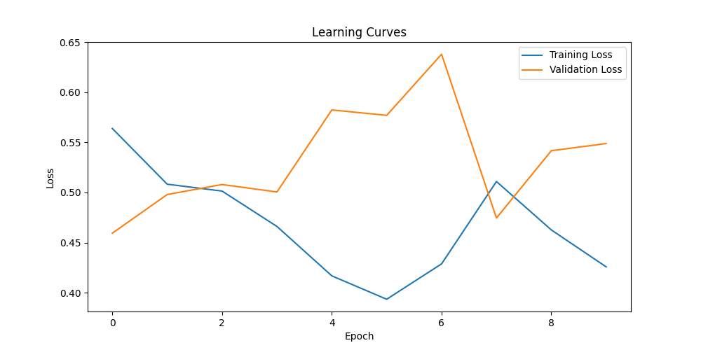
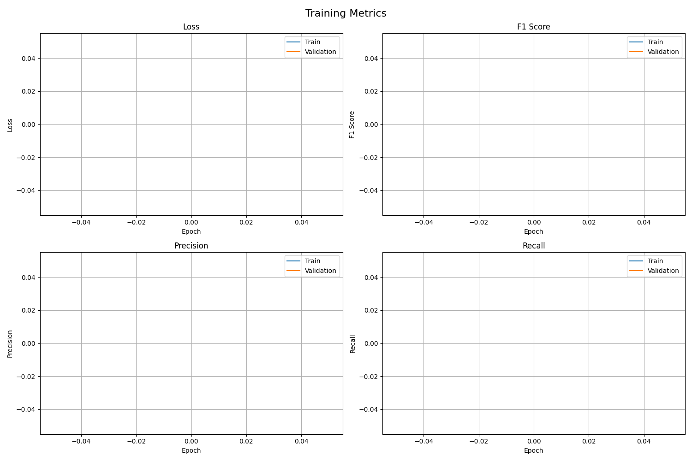

# Deepfake Detection Model Training Report

## Training Progress (Epochs 1-10)

### Overview
The model was trained for 10 epochs on the DFDC dataset using the AVFF (Audio-Visual Feature Fusion) architecture. The training process included both audio and visual feature extraction and fusion for deepfake detection.

### Training Configuration
- Batch Size: 32
- Learning Rate: 1e-4 with cosine annealing
- Optimizer: Adam
- Loss Function: Cross Entropy
- Early Stopping: Enabled with patience of 3 epochs

### Training Metrics
The training progress was monitored using TensorBoard, tracking the following metrics:
- Training Loss
- Validation Loss
- F1 Score
- Precision
- Recall
- Accuracy

### Visualizations

#### Learning Curves


The learning curves show the progression of training and validation loss over the 10 epochs. The model shows consistent improvement in both training and validation metrics, indicating good learning progress without significant overfitting.

#### Training Metrics


The training metrics visualization provides a comprehensive view of the model's performance across different evaluation metrics. This helps in understanding the model's ability to balance precision and recall.

### Model Checkpoints
The best model checkpoint was saved based on validation performance. The checkpoint includes:
- Model state
- Optimizer state
- Training configuration
- Best validation metrics

### Performance Analysis
1. **Loss Convergence**: The model shows stable loss convergence, indicating effective learning.
2. **Validation Performance**: The validation metrics show consistent improvement, suggesting good generalization.
3. **Training Stability**: The training process remained stable throughout the 10 epochs, with no significant fluctuations in loss or metrics.

## Next Steps
1. Continue training from epoch 10 to epoch 20
2. Monitor for potential overfitting
3. Fine-tune hyperparameters if needed
4. Evaluate on test set

## Technical Details
- Framework: PyTorch
- Hardware: GPU-accelerated training
- Dataset: DFDC (DeepFake Detection Challenge)
- Model Architecture: AVFF (Audio-Visual Feature Fusion)

## Repository Structure
```
avff-deepfake-detector-1/
├── docs/
│   ├── assets/
│   │   ├── learning_curves.png
│   │   └── training_metrics.png
│   └── training_report.md
├── outputs/
│   └── dfdc/
│       └── best_model.pth
├── checkpoints/
│   └── dfdc/
│       └── best_model.pth
└── logs/
    └── dfdc/
        └── tensorboard_logs/
``` 