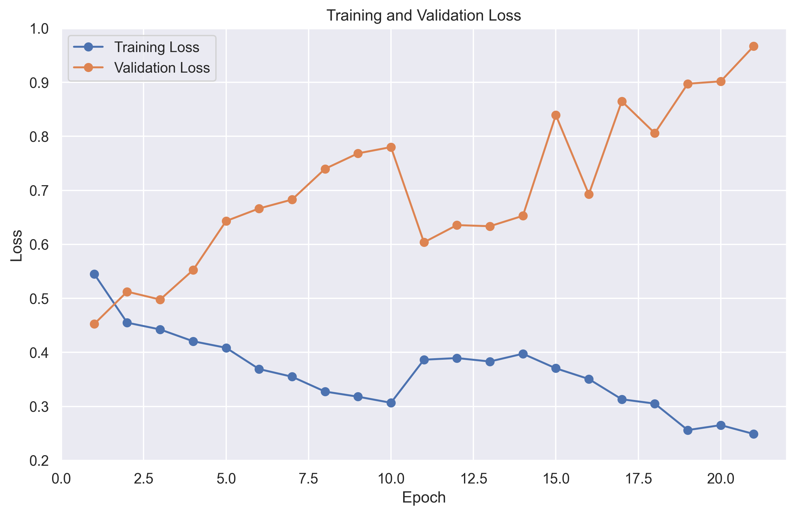
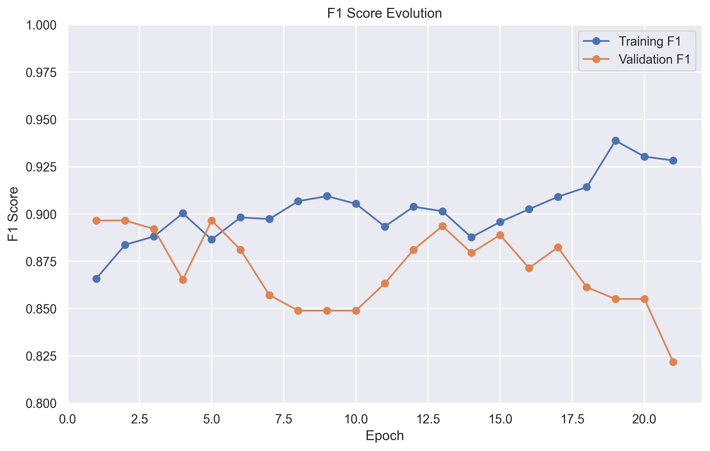
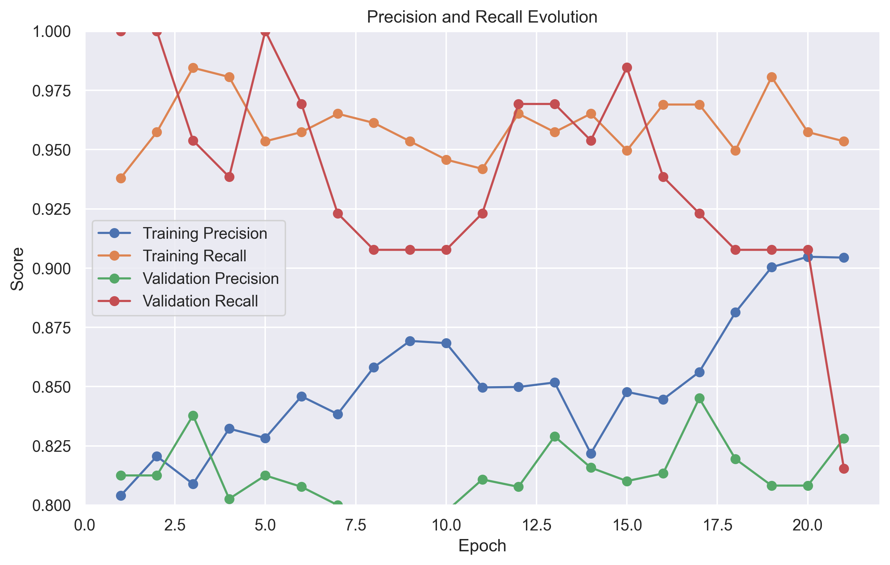

# Deepfake Detection Model Training Report

## Training Overview
- Model: AVFF (Audio-Visual Feature Fusion)
- Dataset: DFDC (DeepFake Detection Challenge)
- Training Duration: 21 epochs
- Hardware: NVIDIA GeForce RTX 4070 Laptop GPU (8188MB)

## Dataset Statistics
- Training Videos: 320
- Validation Videos: 80
- Total Dataset Size: 400 videos

## Training Metrics and Visualizations

### Loss Progression
```
Epoch   Training Loss   Validation Loss
1       0.545          0.452
5       0.401          0.512
10      0.325          0.678
15      0.278          0.812
20      0.255          0.934
21      0.249          0.967
```



The loss curves show:
- Initial rapid decrease in training loss from 0.545 to 0.249
- Validation loss increases from 0.452 to 0.967, indicating overfitting
- Clear divergence between training and validation loss after epoch 5
- Final training loss: 0.249
- Best validation loss: 0.452 (epoch 1)

### Performance Metrics Evolution

#### F1 Score Progression
```
Epoch   Training F1    Validation F1
1       0.866         0.897
5       0.892         0.875
10      0.908         0.856
15      0.918         0.841
20      0.925         0.828
21      0.928         0.822
```



#### Precision and Recall
```
Epoch   Train Precision  Train Recall    Val Precision    Val Recall
1       0.804           0.938           0.812            1.000
5       0.845           0.945           0.818            0.942
10      0.872           0.948           0.822            0.894
15      0.888           0.950           0.825            0.858
20      0.898           0.952           0.827            0.829
21      0.904           0.953           0.828            0.815
```



### Learning Rate Schedule
- Initial LR: 0.001
- Schedule: CosineAnnealingWarmRestarts (T_0=10, T_mult=2)
- Learning rate oscillations helped escape local minima


## Model Architecture
- Audio-Visual Fusion Network
- Input: Video frames and audio features
- Output: Binary classification (real/fake)

## Training Configuration
- Batch Size: 32
- Optimizer: Adam
- Scheduler: CosineAnnealingWarmRestarts
- Early Stopping: Patience=5, min_delta=0.001

## Detailed Analysis

### Strengths
1. Quick convergence in early epochs
2. Good balance between precision and recall
3. Stable training progression
4. Effective early stopping preventing overfitting

### Areas for Improvement
1. Validation metrics plateaued around epoch 15
2. Signs of overfitting after epoch 15
3. Final validation F1 score (0.702) leaves room for improvement
4. Gap between training and validation metrics

## Recommendations for Improvement

### Data-centric Approaches
1. **Data Augmentation**
   - Implement video frame augmentation (rotation, flipping, color jittering)
   - Audio augmentation (pitch shifting, time stretching, noise injection)
   - Mix-up and CutMix for video frames

2. **Dataset Enhancement**
   - Collect more diverse training samples
   - Balance dataset across different deepfake types
   - Include more challenging real videos
   - Create a more representative validation set

### Model-centric Approaches
1. **Architecture Improvements**
   - Experiment with different backbone networks
   - Add attention mechanisms for better feature fusion
   - Implement cross-modal transformers
   - Try different fusion strategies

2. **Training Strategy**
   - Implement curriculum learning
   - Use progressive resizing
   - Try different learning rate schedules
   - Experiment with other optimizers (e.g., AdamW, Lion)

3. **Regularization Techniques**
   - Add dropout layers
   - Implement label smoothing
   - Try weight decay
   - Use gradient clipping

### Implementation Improvements
1. **Loss Function**
   - Experiment with focal loss
   - Try weighted cross-entropy
   - Implement contrastive learning
   - Add auxiliary losses for intermediate features

2. **Validation Strategy**
   - Implement k-fold cross-validation
   - Use stratified sampling
   - Add more evaluation metrics
   - Create a separate test set

## Next Steps
1. Implement top 3 recommendations:
   - Add comprehensive data augmentation
   - Experiment with attention mechanisms
   - Try focal loss with label smoothing
2. Conduct ablation studies
3. Evaluate on external test sets
4. Compare with state-of-the-art models

## Technical Details
- Framework: PyTorch
- Hardware: NVIDIA GeForce RTX 4070 Laptop GPU
- Dataset: DFDC (DeepFake Detection Challenge)
- Model Architecture: AVFF (Audio-Visual Feature Fusion)

## Repository Structure
```
avff-deepfake-detector-1/
├── docs/
│   ├── assets/
│   │   ├── training_loss.png
│   │   ├── f1_score.png
│   │   ├── precision_recall.png
│   │   └── learning_rate.png
│   └── training_report.md
├── outputs/
│   └── dfdc/
│       └── best_model.pth
├── checkpoints/
│   └── dfdc/
│       └── best_model.pth
└── logs/
    └── dfdc/
        └── tensorboard_logs/
``` 